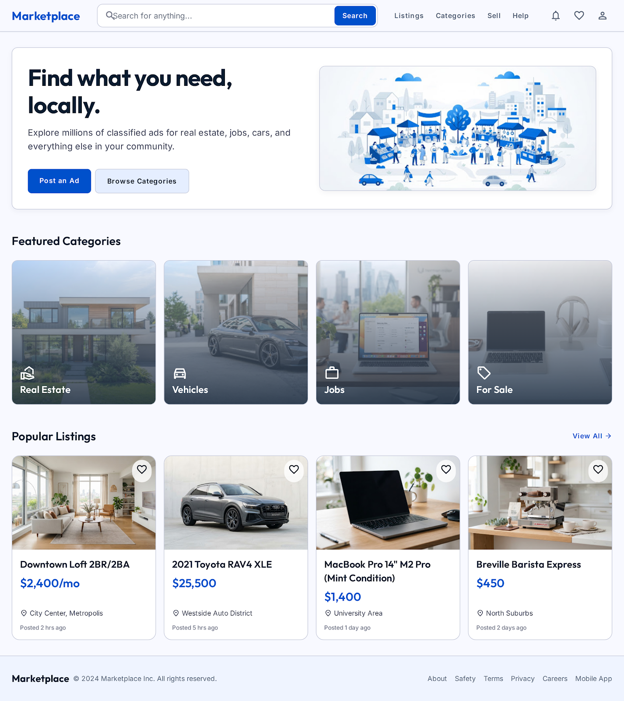
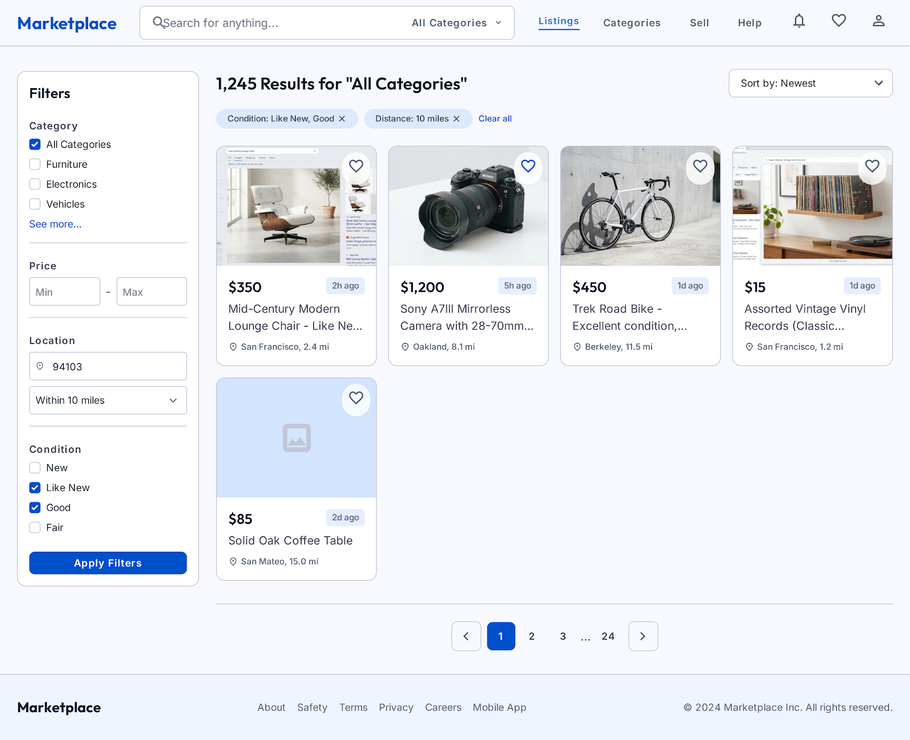
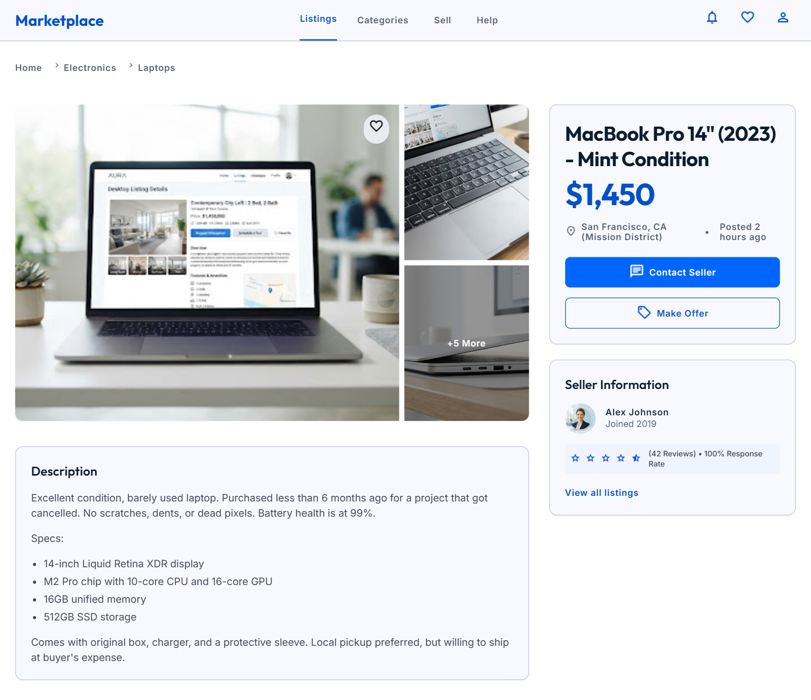
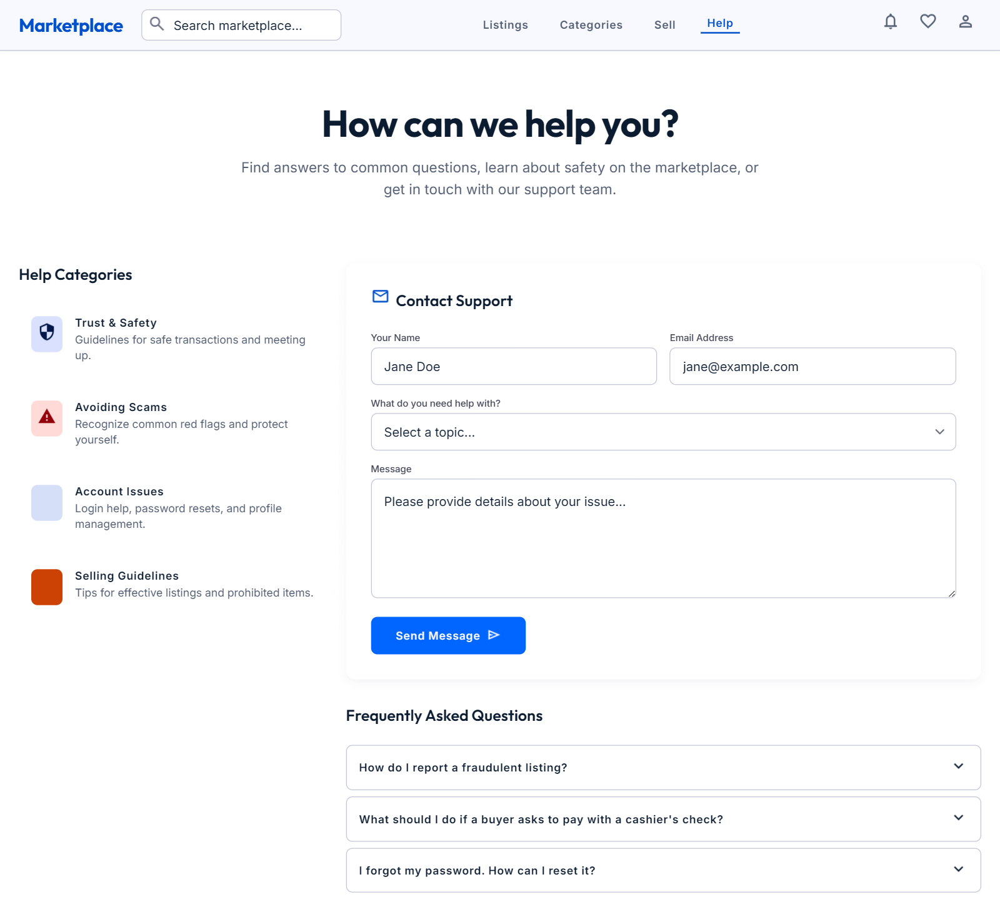
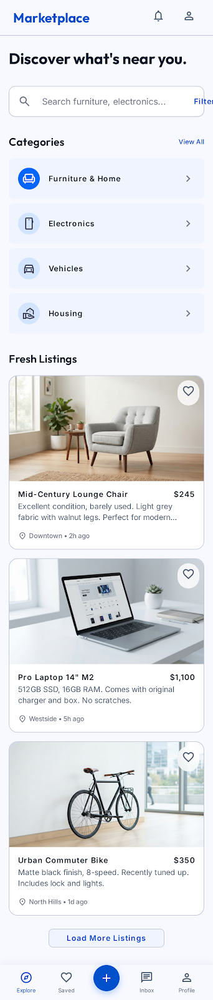
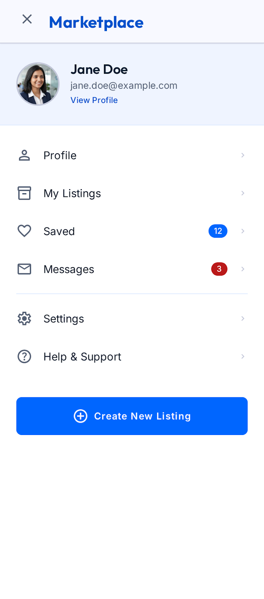
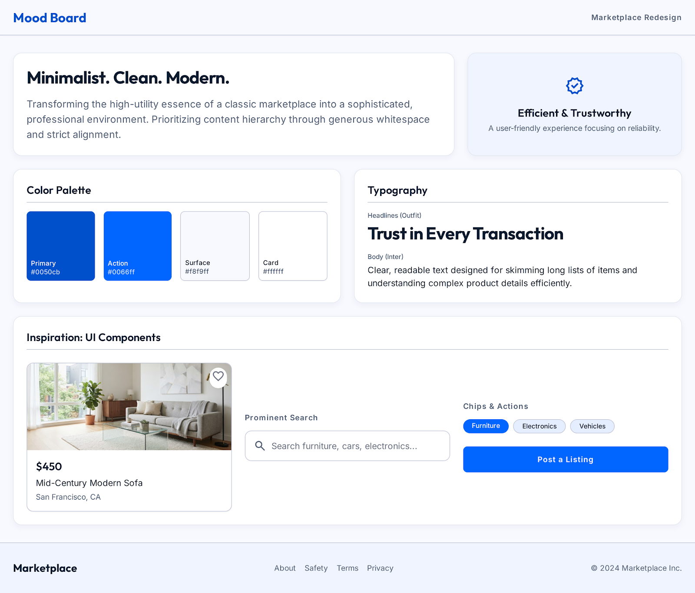
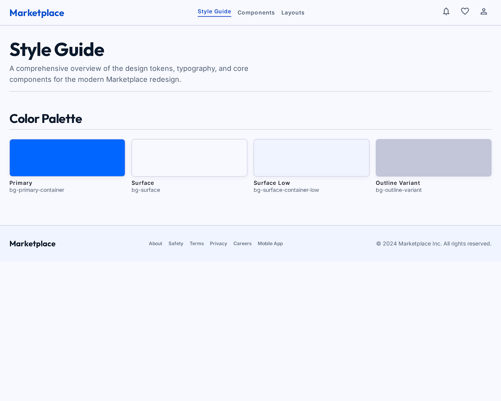

# Website UI Redesign

A high-fidelity redesign of the Craigslist website created as part of a UI/UX design assignment. The project focuses on improving usability, visual hierarchy, responsive layouts, and overall user experience while maintaining the core functionality of an online marketplace.

---

## Project Overview

The redesign modernizes the Craigslist interface with a clean and minimal design, improved navigation, responsive layouts, and a consistent visual style.

The project includes desktop and mobile designs, along with a mood board and style guide to demonstrate the complete UI design process.

---

## Project Deliverables

- Heuristic Evaluation
- Mood Board
- Style Guide
- Desktop High-Fidelity Mockups
- Mobile High-Fidelity Mockups
- Responsive UI Design

---

## Folder Structure

```text
Website-UI-Redesign/
└── images/
    ├── Desktop/
    │   ├── home.png
    │   ├── search-results.png
    │   ├── details.png
    │   └── contact.png
    │
    ├── Mobile/
    │   ├── home.png
    │   ├── search.png
    │   └── menu.png
    │
    ├── Moodboard/
    │   └── moodboard.png
    │
    └── Style-Guide/
        └── style-guide.png
```

---

## Desktop Screens

### Home


### Search Results


### Listing Details


### Contact


---

## Mobile Screens

### Home


### Search


### Menu


---

## Mood Board



---

## Style Guide



---

## Tool Used

- Figma

---

## License

This project was created for educational purposes as part of a Website UI Redesign assignment.
